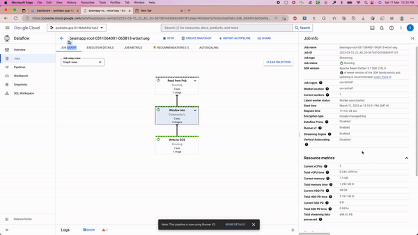

# GCP Data Ingestion & Processing Pipeline with Cloud Dataflow


> End-to-end ingestion and processing pipeline on Google Cloud Platform that streams the **Yelp dataset** through Pub/Sub, transforms it with **Cloud Dataflow (Apache Beam)** in both streaming and batch modes, and loads the results into **BigQuery** — orchestrated by **Cloud Composer (Airflow)**.



## Overview

This project demonstrates a production-style GCP data pipeline covering the full lifecycle — from raw event ingestion to query-ready analytics tables. It showcases stream and batch processing using Dataflow flex templates, event-driven ingestion via Pub/Sub, and DAG-driven orchestration with Cloud Composer.

## Architecture

```
Yelp Dataset ──► Pub/Sub ──► Dataflow (Streaming/Batch) ──► BigQuery
                     ▲                      │
                     │                      └─► Templated Jobs (Flex)
              publish_messages.py
                     │
          Cloud Composer (Airflow DAGs)
```

| Stage | Component | Purpose |
|-------|-----------|---------|
| Ingestion | Cloud Pub/Sub | Event stream buffer for Yelp records |
| Processing | Cloud Dataflow (Apache Beam) | Stream + batch transformation pipelines |
| Storage | BigQuery | Analytics-ready sink |
| Orchestration | Cloud Composer (Airflow) | Schedules & triggers templated Dataflow jobs |

## Tech Stack

- **Google Cloud:** Dataflow, Pub/Sub, BigQuery, Cloud Composer, GCS
- **Apache Beam** (Python SDK)
- **Apache Airflow** (via Cloud Composer)
- **Python 3.8+**

## Project Structure

```
├── Python/
│   ├── dataflow_stream.py / dataflow_stream_templated.py   # Streaming pipelines
│   ├── dataflow_batch.py / dataflow_batch_templated.py     # Batch pipelines
│   ├── template_stream_dag.py / template_batch_dag.py      # Airflow DAGs
│   └── publish_messages.py                                 # Publishes data to Pub/Sub
├── Database/
│   └── publish_config.ini                                  # Pub/Sub + GCS config
├── Resources/                                              # Concept & setup PDFs
└── Installation and Execution/                             # Commands & run guide
```

## How to Run

1. Create a GCP project and enable Dataflow, Pub/Sub, BigQuery, and Composer APIs.
2. Create a Pub/Sub topic and BigQuery dataset/table.
3. Configure `Database/publish_config.ini` with your project, topic, and table details.
4. Deploy the streaming/batch pipelines (or flex templates) from `Python/`.
5. Trigger the DAGs in Cloud Composer to orchestrate templated runs.
6. Publish sample records with `publish_messages.py` and query results in BigQuery.

See `Installation and Execution/Important_Commands.pdf` for step-by-step commands.

## Author

**Kuldeep Pal** — [GitHub](https://github.com/kuldeep27396) · [Portfolio](https://www.kuldeep-pal.in/)
